<p align="center">
  
</p>

<p align="center">
  <b>Hair try-on for a virtual salon web service.</b><br>
  An open re-implementation of the <i>Hair Shifter</i> paper: give it a video of yourself and a photo of a hairstyle, and it re-renders the video with that hairstyle.
</p>

<p align="center">
  
  
  
  
  
</p>

---

## Contents

- [Overview](#overview)
- [Results](#results)
- [Architecture](#architecture)
  - [System overview](#system-overview)
  - [Generator](#generator-training-forward-pass)
  - [Gated GAN: GF-SPADE](#gated-gan-gf-spade)
  - [MSG-SPADE dual-stream decoder](#msg-spade-dual-stream-decoder)
  - [Losses](#losses)
- [Flow](#flow)
  - [Dataset generation](#1-dataset-generation)
  - [Training](#2-training)
  - [Inference](#3-inference)
- [Training curves](#training-curves)
- [Getting started](#getting-started)
- [Project layout](#project-layout)
- [Documentation](#documentation)
- [Acknowledgements](#acknowledgements)

---

## Overview

*Hair Shifter* is a video hair-transfer method. The authors did not release code, so this repository rebuilds the method from the paper and adds the tooling around it to generate data, train, and serve.

Hair editing models such as HairFastGAN work on one aligned image at a time and flicker when you apply them frame by frame. Hair Shifter runs the image editor **once**, on a single well-posed anchor frame. A LivePortrait-style motion network then carries that edited appearance through every frame of the video. A gated decoder decides, pixel by pixel, whether an output pixel comes from the **warped new hair** or from the **original frame's context** (face, background, clothes).

| Component | Role | Origin |
|:--|:--|:--|
| `E_H` Appearance extractor | 3D appearance volume of the source frame | LivePortrait, frozen |
| `E_M` Motion extractor | 21 implicit 3D keypoints per frame | LivePortrait, frozen |
| `W` Warping module | Warps the appearance volume from the source pose to the driving pose | LivePortrait, frozen |
| `E_C` Context encoder | 2D non-hair context features of the driving frame | **trained from scratch** |
| `M_C` Face parser | BiSeNet hair mask (class 17) | BiSeNet, frozen |
| `D_C` Context decoder | SPADE decoder over the context features | LivePortrait, frozen |
| `D_S` Synthesis decoder | SPADE decoder with **GF-SPADE** gates | LivePortrait weights, **only the GF-SPADE layers are trained** |
| `L_adv` Discriminator | Spectral-normalised PatchGAN | **trained from scratch** |
| HairFastGAN | Hair swap on the anchor frame and for training-pair generation | HairFastGAN, frozen |

---

## Results

### Single-image hair swap (HairFastGAN stage)

<table>
  <tr>
    <th align="center">Input (aligned face)</th>
    <th align="center">Hairstyle reference</th>
    <th align="center">Output</th>
  </tr>
  <tr>
    <td></td>
    <td>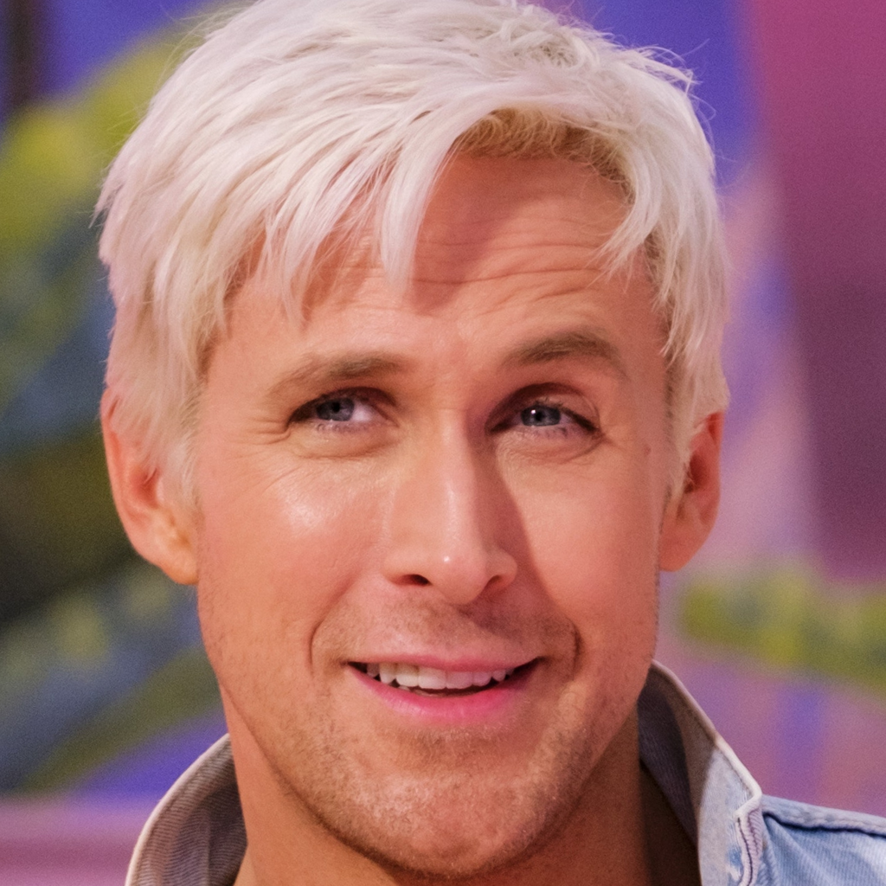</td>
    <td>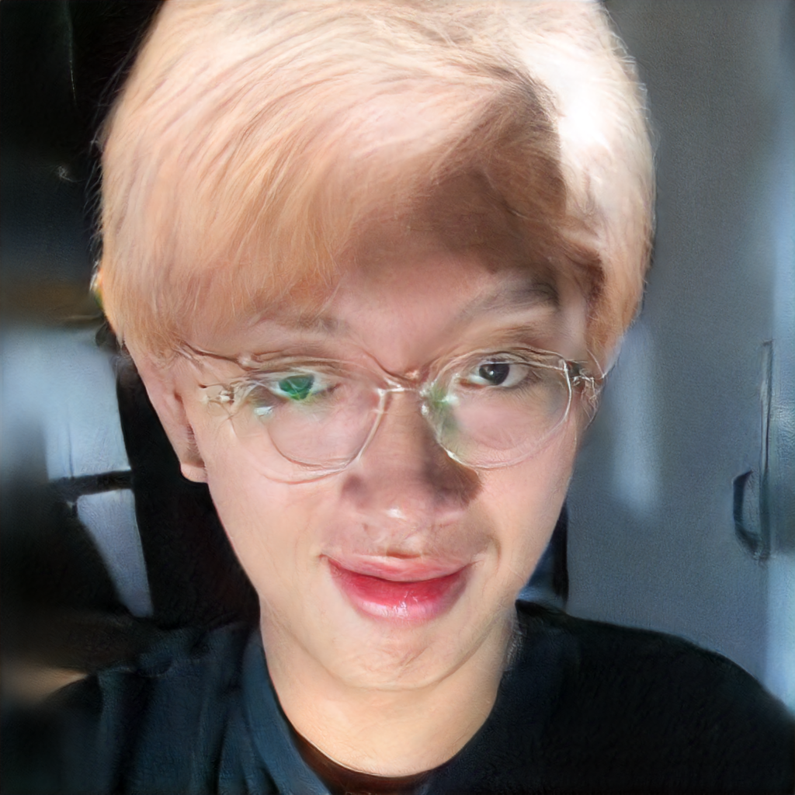</td>
  </tr>
</table>

In the output the shape and colour of the reference hairstyle are carried over. Identity, glasses, expression, and background stay the same.

### Generator training progress: step 99 vs step 899

Each column is one training sample. The bottom row is the generator prediction `I_p`.

<table>
  <tr>
    <th align="center">Step 99</th>
    <th align="center">Step 899</th>
  </tr>
  <tr>
    <td>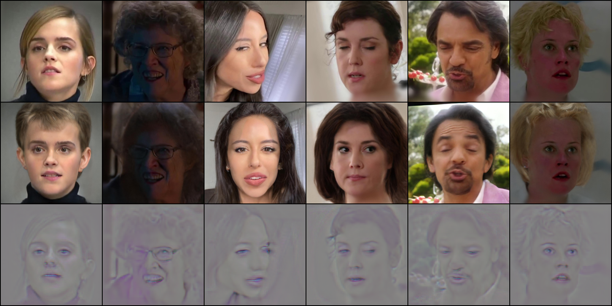</td>
    <td>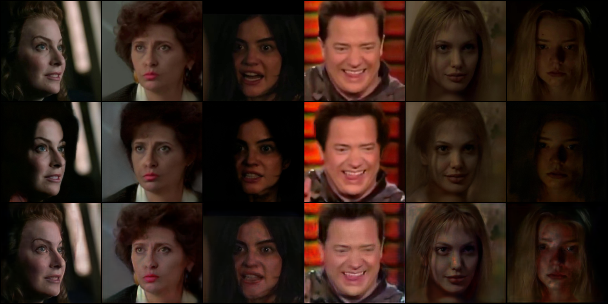</td>
  </tr>
</table>

- **Step 99:** the prediction row is a flat grey ghost. The gates start closed (`gate_conv.bias = -2`) and the new context encoder has not learned anything yet, so only edges and facial features show through.
- **Step 899:** predictions are full-colour, sharp reconstructions with the correct pose, expression, lighting, and hair. The remaining artefacts are mostly on very dark or strongly lit faces.

---

## Architecture

### System overview

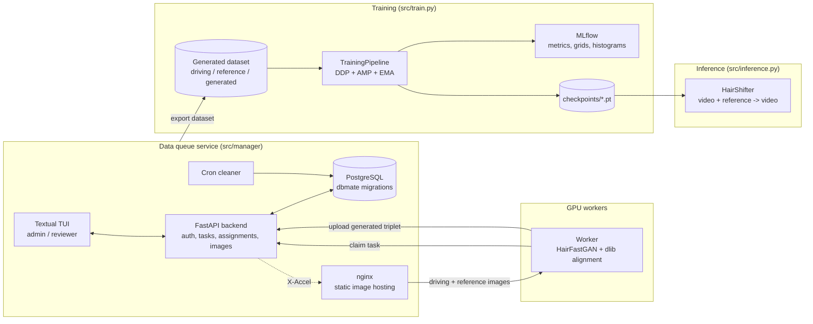

### Generator (training forward pass)

Each training sample is a triplet made by the data pipeline:

| Symbol | Dataset key | Meaning |
|:--|:--|:--|
| `I_s` | `reference` | Side-pose frame of the person, with their **real** hair (hair and appearance source) |
| `I_d` | `driving` | Frontal frame of the same person (**target**) |
| `Ĩ_d` | `generated` | `I_d` with its hair swapped by HairFastGAN (the **corrupted context**) |

The generator has to rebuild `I_d` using the real hair from `I_s` and the non-hair context from `Ĩ_d`. This gives self-supervised hair transfer without any ground-truth "after" images.

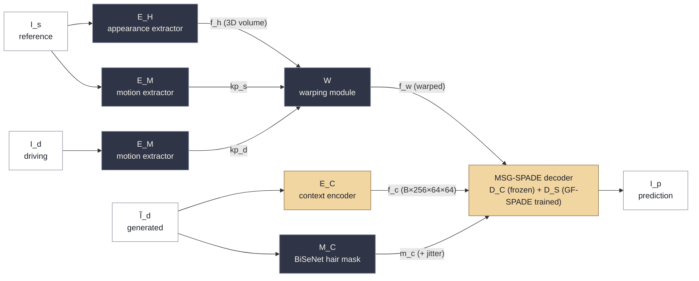

<sub>Dark boxes are frozen pretrained modules. Light boxes are trained.</sub>

### Gated GAN: GF-SPADE

The core idea of Hair Shifter is the **Gated-Fusion SPADE** block (`src/models/gated_fusion_spade.py`). Every residual block of the synthesis decoder has two of them. Each one mixes the synthesis stream `h_w` (warped hair and appearance) with the context stream `h_c` (the driving frame without hair), using a learned spatial gate `m̂`:

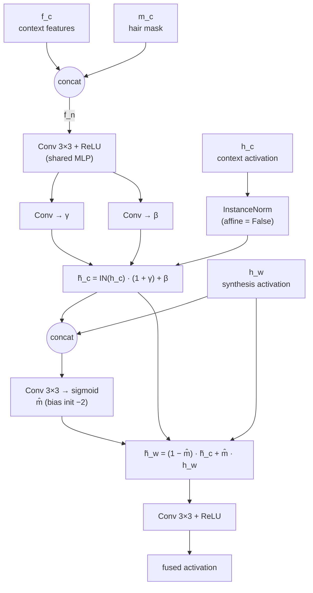

| Equation (paper p. 5) | Code |
|:--|:--|
| Eq. 1: `h̃_c = IN(h_c)·(1+γ(f_n)) + β(f_n)` | `normed * (1 + gamma) + beta` |
| Eq. 2: `m̂ = σ(Conv([h_w, h̃_c]))` | `torch.sigmoid(self.gate_conv(gate_in))` |
| Eq. 3: `h̃_w = (1−m̂)·h̃_c + m̂·h_w` | `(1 - m_hat) * h_c_tilde + m_hat * h_w` |

Initialisation matters here:

- `γ` and `β` start at zero, so the context is passed through unmodulated at first.
- The gate bias starts at `−2` (`σ(−2) ≈ 0.12`), so early on the decoder mostly copies context. It learns to open the gate over hair regions as training goes on. This is why the prediction at step 99 looks like a ghost.

### MSG-SPADE dual-stream decoder

`MSGSpadeDecoder` (`src/models/msg_spade_decoder.py`) runs the frozen context decoder `D_C` and the synthesis decoder `D_S` **in lock-step**. The context stream's normalised activation is fed into the synthesis stream's GF-SPADE at every stage:

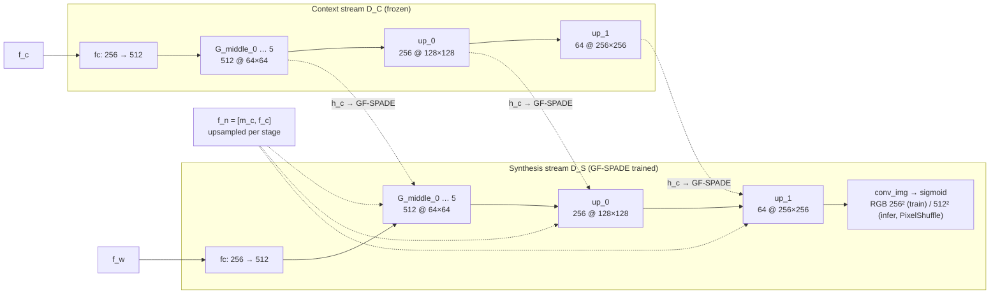

Inside each residual block, the order of operations is:
`SPADE(h, f_w)` → **`GF-SPADE(f_n, h_c, h_w)`** → LeakyReLU → Conv, done twice, plus a learned shortcut.

### Losses

`LossHandler` (`src/losses/loss_handler.py`) combines all the terms. Each weight is set in `src/configs/pipeline_config.yaml` and defaults to 1.

| Loss | Definition | Purpose |
|:--|:--|:--|
| Perceptual `L_p` | VGG feature distance on ImageNet-normalised images | Overall realism and texture |
| Hair `L_hair` | `Σ|m_c ⊙ (I_d − I_p)| / Σ m_c` | Pixel accuracy inside the hair mask |
| Face `L_face` | `Σ|m_f ⊙ (I_d − I_p)| / Σ m_f`, where `m_f = 1 − m_c` | Pixel accuracy outside the hair |
| Global `L_rec` | `L1(I_d, I_p)` | Whole-image reconstruction |
| Adversarial `L_adv` | BCE-with-logits against a spectral-norm **PatchGAN** | Sharpness |

Measures that keep the GAN training stable:

- Label smoothing: real = 0.9, fake = 0.1.
- DiffAugment-style paired augmentation of discriminator inputs (`p = 0.5`).
- Random jitter of the hair mask (`p = 0.5`).
- TTUR learning rates: G `2e-5`, D `2e-4`, Adam `β = (0.5, 0.999)`.
- EMA of the generator weights with a decay that grows each epoch.

---

## Flow

### 1. Dataset generation

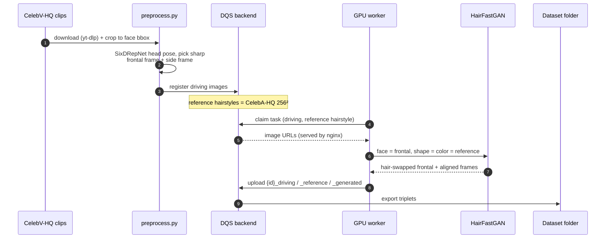

### 2. Training

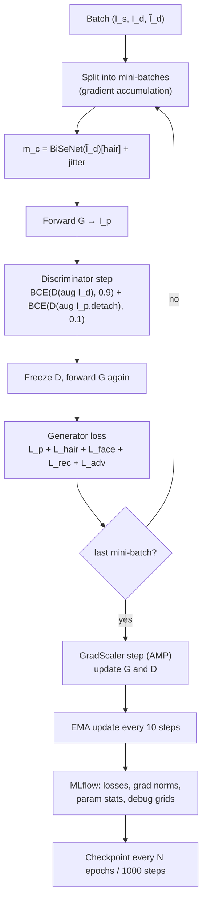

### 3. Inference

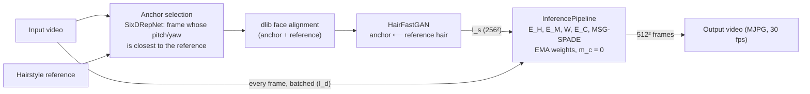

HairFastGAN runs only once per video. Every later frame goes through the lightweight feed-forward generator. With `--poor`, the HairFastGAN and pose models are unloaded after the anchor frame to free VRAM.

---

## Training curves

Losses logged to MLflow over the first ~850 steps (run `persistent-mouse-45`):

<p align="center">
  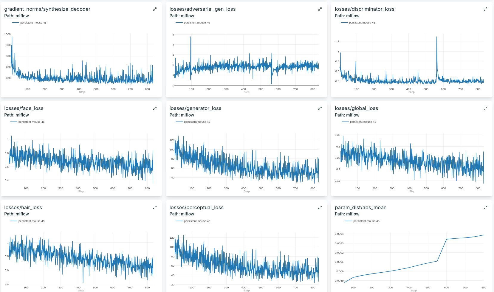
</p>

| Metric | Start | ~850 steps | Notes |
|:--|:--:|:--:|:--|
| Perceptual loss | ~120 | ~45 | Largest term, so it dominates the generator loss (open TODO) |
| Generator loss (total) | ~120 | ~50 | Follows the perceptual loss |
| Hair loss | ~1.0 | ~0.7 | Falls steadily |
| Face loss | ~0.8 | ~0.6 | Falls steadily |
| Global L1 | ~0.30 | ~0.22 | Falls steadily |
| Discriminator loss | ~0.6 | ~0.45 | Stable, with one spike near step 560 that recovers |
| Adversarial (G) | ~1.5 | ~2.0 | Flat, so D and G stay balanced with no collapse |
| Grad-norm, synthesis decoder | ~900 | ~150 | Settles fast after the warm-up spike |

---

## Getting started

### Requirements

- Linux with an NVIDIA GPU (CUDA 11.8)
- Python `3.10.x`
- [Poetry](https://python-poetry.org/), plus `ninja` and `dbmate` for the data service

```bash
make bootstrap-tools          # installs poetry, ninja, dbmate if they are missing
```

### Install

```bash
# core + torch + full model stack
poetry install --with vision,full

# optional groups
poetry install --with test    # pytest
poetry install --with data    # dataset preprocessing (yt-dlp, SixDRepNet)
poetry install --with dqs     # data queue service (FastAPI, Textual)
poetry install --with dev     # ruff
```

Every entry point expects `src` and `libs` on the path:

```bash
export PYTHONPATH=src:libs
```

Pretrained weights (LivePortrait, BiSeNet, HairFastGAN) are resolved through the model registry in `src/loaders/registry.py`. They download automatically to `weights/` on first use.

### Single-image hair swap

```bash
poetry run python src/demos/run_gan_iiht.py
```

### Train

```bash
# optional: MLflow backend store
cp .env.example .env && docker compose up -d
mlflow server --host 0.0.0.0 --port 5000        # default URI used by MLflowManager

# download the generated triplet dataset into ./assets/dataset
make generated-download

# launch (1 node, N GPUs)
poetry run torchrun --nproc_per_node=1 src/train.py \
    --batch_size 4 --mini_batch_size 2 \
    --mixed_precision --mlflow
```

| Flag | Default | Description |
|:--|:--|:--|
| `--dataset` | `./assets/dataset` | Folder of `{id}_driving / _reference / _generated` images |
| `--batch_size` / `--mini_batch_size` | `4` / `2` | Global batch and accumulation chunk |
| `--epochs` | `100` | Number of epochs |
| `--save_dir` / `--save_weight_every` | `./checkpoints/` / `10` | Checkpoint location and frequency |
| `--resume` | none | Resume from a checkpoint |
| `--mixed_precision` | off | Enable AMP |
| `--mlflow` | off | Log to the MLflow server |

### Inference (video)

```bash
poetry run python src/inference.py \
    --checkpoint ./checkpoints/test.pt \
    --video      ./assets/test_images/phuc.mp4 \
    --reference  ./assets/test_images/ken.png \
    --output     ./assets/test.avi \
    --batch_size 2 --ema
```

| Flag | Description |
|:--|:--|
| `--align` | Align every frame with dlib before inference |
| `--ema` | Use the EMA generator weights (recommended) |
| `--poor` | Free HairFastGAN and pose models after the anchor frame (low VRAM) |

### Data queue service

```bash
cp src/manager/.env.example src/manager/.env   # fill in credentials
make dataset-download                          # CelebA-HQ references + driving frames
make stack-up                                  # db → migration → backend, nginx, cron
make seed                                      # create admin and seed data
make worker                                    # start a GPU worker
make tui                                       # open the management TUI
```

Run `make help` to list every target.

### Tests

```bash
PYTHONPATH=src:libs poetry run pytest
```

CI (`.github/workflows/ci.yml`) runs the suite on every pull request to `main`.

---

## Project layout

```text
DP-AR-Hair/
├── src/
│   ├── models/          # ContextEncoder, GF-SPADE, SynthesisDecoder, MSG-SPADE decoder
│   ├── losses/          # perceptual, local (hair / face), PatchGAN adversarial, LossHandler
│   ├── pipelines/       # TrainingPipeline, InferencePipeline, HairFast batch wrapper
│   ├── loaders/         # model registry, weight loader & downloader
│   ├── data/            # CelebV-HQ preprocessing, datasets, validator
│   ├── hairshifter/     # EMA, MLflow manager, logging utilities
│   ├── manager/         # data queue service: FastAPI, Postgres, nginx, cron, TUI, worker
│   ├── configs/         # model_config.yaml, pipeline_config.yaml (pydantic-validated)
│   ├── demos/           # face parsing & HairFastGAN demos
│   ├── train.py         # DDP training launcher
│   └── inference.py     # video hair transfer
├── libs/
│   ├── live_portrait/   # adapted LivePortrait modules
│   ├── hair_gan/        # adapted HairFastGAN
│   └── face_parsing/    # BiSeNet face parser
├── docs/                # MkDocs documentation
├── references/          # papers (Hair Shifter, LivePortrait, SPADE, BiSeNet, ...)
├── notebooks/           # exploration notebooks
├── tests/               # pytest suite
└── assets/              # test images, results, logo
```

---

## Documentation

Module-level documentation is in [`docs/`](docs/) and builds with MkDocs:

```bash
pip install mkdocs && mkdocs serve
```

Key pages: [Training pipeline](docs/training_pipeline.md) · [GF-SPADE](docs/gated_fusion_spade.md) · [MSG-SPADE decoder](docs/msg_spade_decoder.md) · [Warping network](docs/warping_network.md) · [Losses](docs/loss_handler.md) · [Dataset](docs/dataset.md) · [Model registry](docs/registry.md)

---

## Acknowledgements

This project builds on the following work. Each adapted library under `libs/` keeps its own attribution README.

- **Hair Shifter**: the method this repository re-implements (`references/hair-shifter.pdf`)
- [**LivePortrait**](https://github.com/KlingTeam/LivePortrait): appearance/motion extractors, warping module, SPADE decoder
- [**HairFastGAN**](https://github.com/AIRI-Institute/HairFastGAN): single-image hair transfer
- **BiSeNet**: face parsing
- **SPADE**: spatially-adaptive normalisation
- **CelebV-HQ** and **CelebA-HQ**: training data

## Authors

- Vu Hoang Hai Binh
- Tran Phan Gia Phuc

## License

Released under the [MIT License](LICENSE). Third-party components under `libs/` keep their original licenses.
